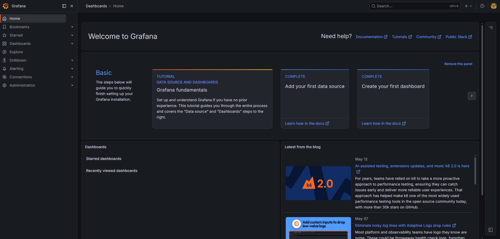
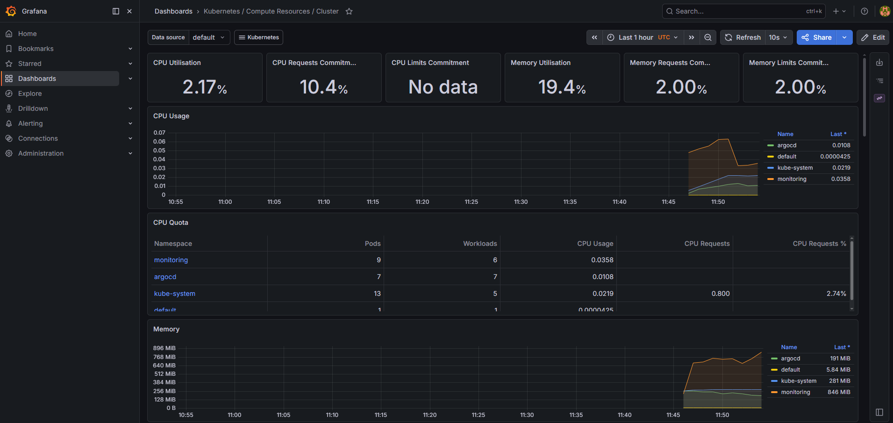
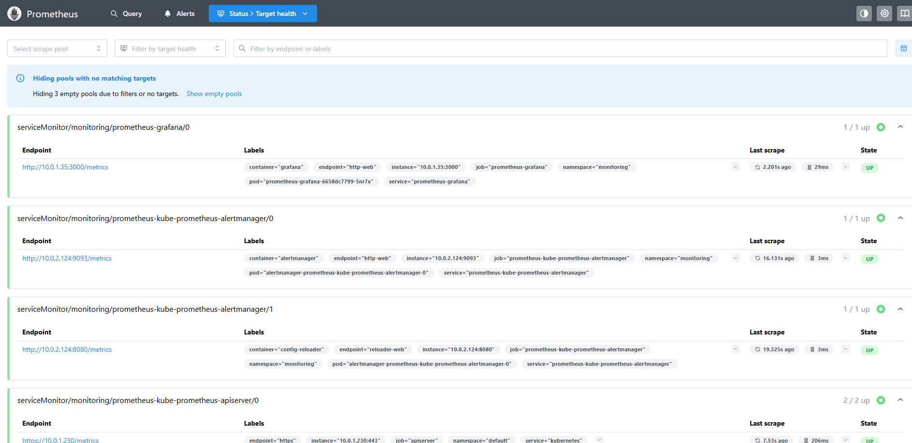

# Platform Monitoring Stack

A Kubernetes-native monitoring and observability stack using Prometheus and Grafana.

---

## Features

- Prometheus metrics collection
- Grafana dashboards and visualization
- Kubernetes monitoring
- Application performance metrics
- Cluster observability
- GitOps-friendly configuration

---

## Stack Components

### Prometheus
Responsible for:
- Metrics scraping
- Time-series storage
- Target discovery
- Alert rule evaluation

### Grafana
Responsible for:
- Metrics visualization
- Dashboard management
- Alerting
- Monitoring insights

---

## Repository Structure

```bash
.
├── grafana/
│   ├── dashboards/
│   ├── datasources/
│   └── deployment.yaml
│
├── prometheus/
│   ├── config-map.yaml
│   ├── deployment.yaml
│   └── service.yaml
│
├── Screenshots/
│   ├── grafana-dashboard.png
│   ├── grafana-metrics.png
│   └── prometheus-targets.png
│
└── README.md
```

---

## Screenshots

### Grafana Dashboard



### Grafana Metrics



### Prometheus Targets



---

## Deployment

### Apply Prometheus

```bash
kubectl apply -f prometheus/
```

### Apply Grafana

```bash
kubectl apply -f grafana/
```

---

## Verify Deployments

```bash
kubectl get pods -A
```

```bash
kubectl get svc -A
```

---

## Access Grafana

```bash
kubectl port-forward svc/grafana 3000:3000
```

Open:

```text
http://localhost:3000
```

Default credentials:

```text
admin / admin
```

---

## Access Prometheus

```bash
kubectl port-forward svc/prometheus 9090:9090
```

Open:

```text
http://localhost:9090
```

---

## Monitoring Targets

Prometheus automatically scrapes:
- Kubernetes nodes
- Pods
- Services
- Application endpoints

---

## Future Improvements

- Alertmanager integration
- Loki logging stack
- Distributed tracing
- Persistent storage
- Helm chart packaging
- ArgoCD GitOps deployment

---

## License

MIT
